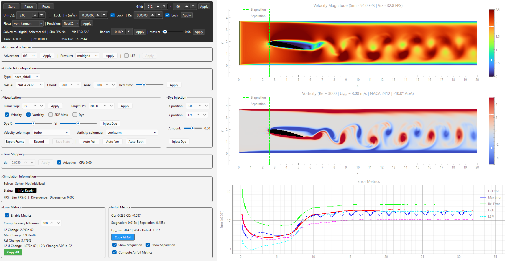

# Differentiable CFD-ML

A real-time JAX-based CFD framework for interactive incompressible flow simulation, immersed boundaries, and ML-ready workflows.

> Differentiable CFD-ML is a high-performance CFD framework for real-time incompressible flow simulation, live diagnostics, and rapid synthetic data generation for CFD–ML research.

**Demo Video:**


**GUI Screenshot:**



**Key Dependencies:**
- [JAX](https://jax.readthedocs.io/) - Differentiable numerical computing
- [PyQt6](https://www.riverbankcomputing.com/static/Docs/PyQt6/) - GUI framework
- [pyqtgraph](https://pyqtgraph.readthedocs.io/) - Scientific visualization
- [NumPy](https://numpy.org/) - Numerical computing

---

## Quick Start

```bash
git clone https://github.com/arriemeijer-creator/JAX-differentiable-CFD
cd JAX-differentiable-CFD
pip install -r requirements.txt
python main.py
```

**First run tips:**

- Start with 512×96 grid for real-time performance
- Try von_karman flow with a NACA 2412 airfoil
- Enable "Adaptive dt" to see the PID controller in action

---

## What Makes This Framework Distinct

This framework combines:

- Real-time 2D incompressible CFD with interactive GUI control
- Differentiable immersed boundary simulation via Brinkman penalization
- Adaptive divergence-aware timestep control using PID feedback
- Multi-solver pressure projection (FFT / CG / multigrid)
- Live diagnostics (forces, divergence, enstrophy, pressure metrics)
- High-throughput synthetic data generation for ML workflows
- Decoupled simulation and rendering architecture for stable performance
- Control-driven numerical stability rather than static CFL tuning

This makes it useful for:

- CFD education and visualization
- Numerical method development and experimentation
- Neural operator and CFD–ML research
- Inverse design prototyping and flow interrogation

---

## Core Simulation Architecture

### 1. Solver Design

The framework implements a JAX-accelerated incompressible Navier–Stokes solver with:

- Projection-based (fractional-step) pressure coupling
- Explicit RK3 advection scheme
- Structured Cartesian grid (2D)
- Immersed boundary forcing via Brinkman penalization
- Optional LES closures (Smagorinsky variants: constant or dynamic)

The solver is designed for real-time execution and parameter interactivity rather than batch-only workflows.

### 2. Immersed Boundary System

#### Brinkman Penalization

Solid bodies are embedded using a porous-medium forcing formulation:

- Velocity damping inside solid regions via resistance term
- No body-fitted meshing required
- Smooth fluid–structure interaction

#### Smoothed Interface Representation

Geometry is represented using a continuous mask field:

- Smoothed Heaviside function
- Interface thickness controlled by epsilon (ε)
- Preserves numerical stability and differentiability

#### Supported geometries

- Cylinders
- NACA 4-digit airfoils
- Extensible parametric shapes

### 3. Adaptive Time Stepping (Divergence-PID Controller)

Time integration is governed by a closed-loop feedback controller.

#### Control Objective

`max(|∇ · u|) → target divergence`

#### Control System

A PID controller adjusts timestep based on incompressibility error:

- Proportional: instantaneous divergence error
- Integral: accumulated drift correction
- Derivative: instability growth prediction

#### Stability Constraints

Timestep is additionally bounded by:

- Brinkman stiffness limiter (η-dependent)
- Hard limits: dt_min / dt_max

> The solver behaves as a self-regulating numerical dynamical system with feedback-controlled stability.

### 4. Numerical Methods

#### Advection

- Explicit RK3 scheme

#### Pressure Projection (selectable)

- FFT-based Poisson solver (periodic cases)
- Conjugate Gradient solver
- Multigrid solver

#### Spatial Discretization

- Structured Cartesian grid

#### Typical operating resolutions:

- 512 × 96 — real-time interactive
- 1024 × 192 — high fidelity
- up to ~3000 × 600 for larger experiments

### 5. Turbulence Modeling (LES Mode)

Optional LES support includes:

- Smagorinsky-type subgrid closure
- Constant or dynamic formulations

Enables more stable higher-Re simulations when needed.

---

## Parallel Architecture

### 6. Simulation–GUI Decoupling

The system is split into two independent subsystems:

- Simulation thread (JAX solver)
- GUI thread (PyQt6 visualization)

#### Communication uses:

- Shared memory buffers for zero-copy field transfer
- Lightweight metadata queues

#### Key properties:

- Simulation and rendering FPS are decoupled
- Frame dropping under load prevents blocking
- Stable interactivity under varying computational cost

### 7. Shared Memory Data Pipeline

Transferred fields include:

- Velocity (u, v)
- Vorticity
- Scalar dye transport
- Derived diagnostics (velocity magnitude, etc.)

This enables real-time visualization without repeated JAX → CPU → GUI copy overhead.

---

## Flow Configuration Space

### Geometry Parameters

- Cylinder radius
- NACA airfoil type
- Chord length
- Angle of attack
- Spatial placement

### Flow Parameters

- Reynolds number (Re)
- Domain size
- Inflow conditions

### Numerical Parameters

- epsilon (ε): interface smoothing scale
- eta (η): Brinkman damping strength
- dt bounds
- Pressure solver selection
- LES toggles

---

## Diagnostics and Output Quantities

### Field Outputs

- Velocity field (u, v)
- Pressure field (p)
- Vorticity field (ω)
- Scalar dye transport field
- Immersed boundary mask field

### Numerical Diagnostics

- Maximum divergence
- CFL tracking
- L2 / max / relative change metrics
- Component-wise velocity error measures

### Aerodynamic Metrics (Airfoils)

Computed in real time

- Lift coefficient (CL)
- Drag coefficient (CD)
- Stagnation point location
- Separation point estimate
- Minimum pressure coefficient (Cp_min)
- Wake deficit metrics

---

## Interactive GUI System

### Simulation Controls

- Start / pause / reset
- Grid resizing
- Flow regime switching

### Physical Controls

- Reynolds number
- Geometry configuration
- Angle of attack
- Obstacle type selection

### Numerical Controls

- Solver type selection
- LES toggle
- epsilon and eta tuning
- Adaptive timestep settings

### Visualization Controls

- Velocity / vorticity / dye display modes
- Colormap selection
- FPS controls
- Auto-scaling tools
- Frame export / recording

---

## Performance Characteristics

Differentiable CFD-ML is designed for stable real-time performance across a wide range of resolutions, with simulation throughput largely independent of GUI rendering load due to the decoupled architecture.

### Typical CPU performance

| Configuration | Solver + visualization only | With live metrics + diagnostics |
|--------------|------------------------------|----------------------------------|
| 512 × 96     | ~297 FPS                     | ~170 FPS                         |
| 1024 × 192   | ~131 FPS                     | ~91 FPS                          |
| 2084 × 384   | ~37 FPS                      | ~31 FPS                          |

### Key observations:

- Real-time interactivity is maintained at standard working resolutions
- Diagnostic overhead remains modest even with live force and stability metrics enabled
- Shared-memory rendering prevents visualization from throttling solver throughput
- Higher-resolution runs remain practical for detailed analysis and dataset generation

> Solver performance is governed primarily by numerical workload rather than interface overhead, enabling consistent interactive use across exploratory and higher-fidelity modes.

---

## Validation & Benchmark Cases

### Validated against

- Lid-driven cavity flow
- Taylor–Green vortex decay
- Von Kármán vortex shedding

### Used for

- Solver verification
- Numerical stability testing
- ML dataset generation

---

## System Characterization

### This framework is best understood as

- A real-time incompressible CFD solver
- A Brinkman immersed boundary system
- A feedback-controlled numerical dynamical system
- A live diagnostic physics platform
- A synthetic data engine for ML workflows

### It is not

- A general-purpose industrial CFD suite
- A mesh-based finite-volume framework
- A high-Re DNS turbulence solver
- A fully validated aerodynamic design tool (yet)

---

## Design Philosophy

- Minimal abstraction overhead
- Direct control of numerical and physical parameters
- Tight coupling between simulation and observation
- Real-time feedback loops for stability and control
- Differentiability-first JAX-native design

---

## Capabilities

- Real-time 2D incompressible CFD solver
- PyQt6 interactive GUI
- Immersed boundaries (cylinders + NACA airfoils)
- Divergence-PID adaptive timestep controller
- Brinkman penalization system
- Threaded simulation architecture
- Shared memory visualization pipeline
- Export and recording tools

---

## Project Structure


```
NUWE-DT-CONTROLLER/
├── LICENSE
├── README.md
├── requirements.txt (28 lines)
├── main.py (684 lines)
├── naca_airfoils.py (294 lines)
├── grid_requirements.py (147 lines)
├── test_diff_rollout.py (28 lines)
├── test_multigrid_diff.py (35 lines)
├── test_stability.py (80 lines)
│
├── advection_schemes/
│   ├── __init__.py (9 lines)
│   ├── rk3_scheme.py (428 lines)
│   ├── spectral_scheme.py (85 lines)
│   ├── tvd_scheme.py (93 lines)
│   ├── utils.py (38 lines)
│   └── weno5_scheme.py (102 lines)
│
├── backup/
│   ├── baseline/
│   ├── examples/
│   ├── inverse/
│   ├── latent/
│   └── (various backup files)
│
├── pressure_solvers/
│   ├── __init__.py (7 lines)
│   ├── cg_solver_new.py (471 lines)
│   ├── fft_solver.py (34 lines)
│   ├── multigrid_solver.py (167 lines)
│   └── sor_masked.py (176 lines)
│
├── solver/
│   ├── __init__.py (78 lines)
│   ├── boundary_conditions.py (98 lines)
│   ├── brinkman.py (132 lines)
│   ├── config.py (26 lines)
│   ├── geometry.py (26 lines)
│   ├── les_models.py (139 lines)
│   ├── metrics.py (86 lines)
│   ├── operators.py (116 lines)
│   ├── params.py (276 lines)
│   └── solver.py (983 lines)
│
├── timestepping/
│   ├── __init__.py (21 lines)
│   ├── adaptivedt.py (54 lines)
│   └── example_usage.py (47 lines)
│
└── viewer/
    ├── __init__.py (32 lines)
    ├── config.py (230 lines)
    ├── display_manager.py (279 lines)
    ├── flow_manager.py (197 lines)
    ├── naca_handler.py (150 lines)
    ├── simulation_controller.py (794 lines)
    ├── ui_components.py (1501 lines)
    └── visualization.py (1381 lines)
```

**Core solver (differentiable, JAX):** ~2,000 lines
**GUI & visualization:** ~4,500 lines
**Advection & pressure solvers:** ~1,500 lines
**Total functional code:** ~8,000 lines (excluding backups)


---

## License

GNU Lesser General Public License v3.0

---

## Author

Arno Meijer
Mechanical Engineer | CFD–ML Systems Developer

---

## Citation

```bibtex
@misc{meijer2026differentiablecfd,
  author = {Meijer, Arno},
  title = {JAX-Based Differentiable CFD Framework},
  year = {2026},
  url = {https://github.com/arriemeijer-creator/JAX-differentiable-CFD}
}
```

